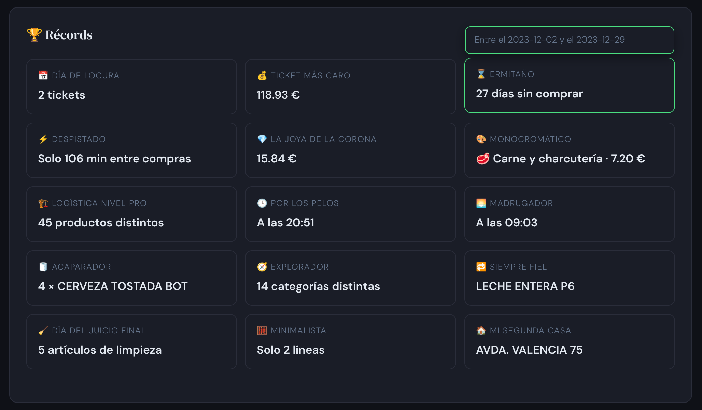

# Mercadona Ticket Analyzer

Herramienta en Python para importar, almacenar y analizar los tickets de compra de Mercadona a partir de los tickets en PDF que envían por correo electrónico.

---

## ¿Para qué sirve?

Mercadona envía un ticket en PDF por cada compra, si se ha registrado la tarjeta de crédito para ello. Este proyecto convierte esos PDFs en una base de datos SQLite y genera un informe HTML interactivo que permite ver el gasto por categoría, por mes, por tienda, la evolución del precio de cada artículo a lo largo del tiempo y alertas cuando un producto ha subido de precio respecto a su media histórica.

---

## Requisitos

- Python 3.9 o superior

No se necesitan más dependencias externas. El informe HTML funciona directamente en el navegador sin servidor.

---

## Instalación

```bash
git clone https://github.com/pezbailarin/mercadona-ticket-analyzer
cd mercadona-ticket-analyzer
python -m venv venv
source venv/bin/activate        # bash / zsh
venv\Scripts\Activate.ps1       # PowerShell
source venv/bin/activate.csh    # csh / tcsh
source venv/bin/activate.fish   # fish
pip install -r requirements.txt
```

La base de datos se crea automáticamente en el primer uso.

## Configuración

Copia `.env.example` a `.env` y edita los valores:

```bash
cp .env.example .env
```

| Variable | Descripción | Por defecto |
|---|---|---|
| `EMAIL_ADDR` | Cuenta Gmail para descargar tickets | — |
| `APP_PASSWORD` | Contraseña de aplicación de Google | — |
| `SAVE_DIR` | Carpeta donde `retrieve.py` descarga los PDFs | — |
| `IMAP_FOLDER` | Carpeta IMAP de Gmail (`[Gmail]/All Mail` en inglés) | `[Google Mail]/Todos` |
| `DB_PATH` | Ruta a la base de datos SQLite | `mercadona.db` junto a los scripts |
| `PROCESSED_DIR` | PDFs procesados con éxito | `tickets_procesados/` junto a los scripts |
| `ERROR_DIR` | PDFs que no se han podido parsear | `tickets_error/` junto a los scripts |
| `OUTPUT_DIR` | Directorio de salida del informe HTML | junto a los scripts |
| `LOG_DIR` | Directorio de logs de `run.py` | `logs/` junto a los scripts |
| `LOG_RETENTION_DAYS` | Días que se conservan los logs | `30` |
| `BACKUP_DIR` | Directorio de backups de la BD | `backups/` junto a los scripts |
| `BACKUP_COUNT` | Número de backups a conservar | `30` |

Se recomiendan rutas absolutas para evitar ambigüedad, especialmente al ejecutar desde cron.

---

## Uso

### Descargar tickets del correo

```bash
python3 retrieve.py            # Solo busca en emails enviados por mercadona
python3 retrieve.py 30         # Busca en todos los emails de los últimos 30 días
python3 retrieve.py 7          # Busca en todos los emails de  los últimos 7 días
python3 retrieve.py --todos    # toda la bandeja sin filtro de remitente (puede tardar)
python3 retrieve.py --todos 7  # toda la bandeja, últimos 7 días
```

Si otra persona te reenvía tickets de Mercadona, usa `--dias N` o `--todos --dias N` para capturarlos.

### Importar tickets PDF

```bash
python3 main.py                      # procesa la carpeta SAVE_DIR del .env
python3 main.py ticket.pdf           # un solo PDF
python3 main.py carpeta_con_pdfs/    # todos los PDFs de una carpeta
```

Los PDFs procesados con éxito se mueven automáticamente a `PROCESSED_DIR`.

### Generar el informe

```bash
python3 stats.py                         # genera informe.html
python3 stats.py --output enero.html     # nombre de salida personalizado
python3 stats.py --sin-familia           # lista productos sin categoría y sale
python3 stats.py --csv ./exportacion/    # exporta datos a CSV y sale
```

Abre el HTML resultante en cualquier navegador. No requiere conexión a internet después de la primera generación (Chart.js se descarga y cachea en `.chartjs.cache.js`).

### Introducir un ticket manualmente

Si tienes un ticket en papel o falla la importación automática, se puede introducir a mano en el sistema.

```bash
python3 manual.py            # introducir ticket nuevo
python3 manual.py --borrar   # buscar y borrar un ticket por nº de factura
```

### Gestionar categorías y tarjetas

```bash
python3 categorizar.py               # categorizar productos sin familia; si no hay, abre el buscador
python3 categorizar.py --lista       # ver todos los productos agrupados por familia
python3 categorizar.py --buscar      # buscar y editar cualquier producto directamente.
python3 categorizar.py --tarjetas    # gestionar etiquetas de tarjetas de pago.
python3 categorizar.py --auto        # auto-asigna categorías a los productos sin ella.
```

---

## Automatización (cron)

Para ejecutar el ciclo completo por ejemplo cada día a las 22:35:

```
35 22 * * * cd /ruta/al/proyecto && /ruta/al/proyecto/venv/bin/python3 run.py
```

`run.py` encadena retrieve → main → stats con control de errores, hace un backup de la BD antes de cada ejecución y escribe un log diario en `logs/`.

```bash
python3 run.py                   # ciclo completo
python3 run.py --sin-retrieve    # solo main + stats
python3 run.py --dias 7          # retrieve solo de los últimos 7 días
```

---

## Ejemplo rápido

```bash
# 1. Importar todos los PDFs descargados
python3 main.py /ruta/a/los/pdfs/

# 2. Categorizar los productos nuevos (si los hay)
python3 categorizar.py

# 3. Ver el informe
python3 stats.py && open informe.html
```

---

## Estructura del proyecto

| Fichero | Descripción |
|---|---|
| `main.py` | Importa PDFs a la BD |
| `parser.py` | Extrae datos del texto del PDF |
| `db.py` | Gestión de la base de datos SQLite |
| `stats.py` | Genera el informe HTML interactivo |
| `categorizar.py` | Asignación interactiva de categorías y gestión de tarjetas |
| `manual.py` | Introducción y borrado manual de tickets |
| `retrieve.py` | Descarga PDFs desde Gmail |
| `run.py` | Orquestador: retrieve → main → stats |
| `mercadona.db` | Base de datos (se crea automáticamente) |
| `tickets_procesados/` | PDFs ya importados (se crea automáticamente) |

---



